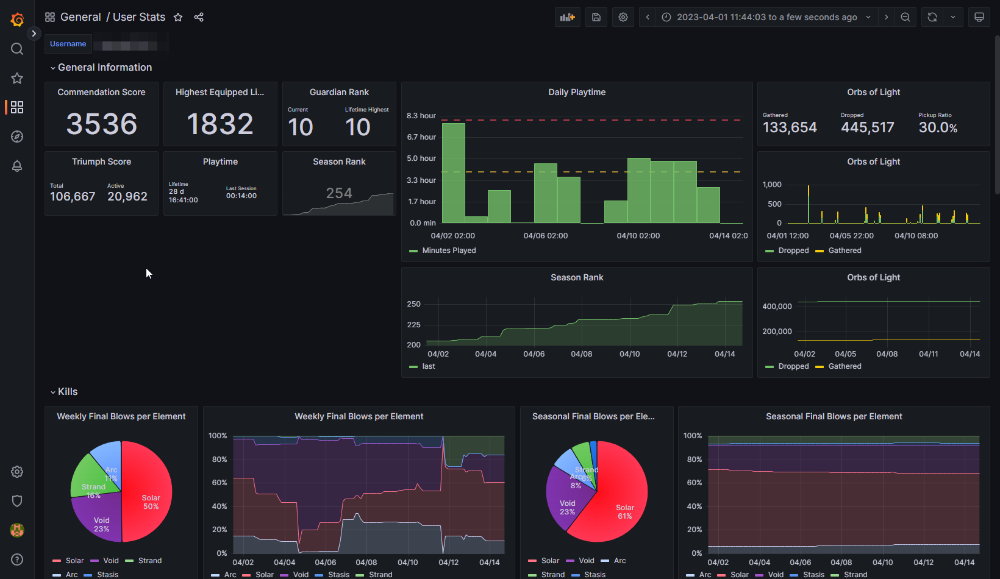
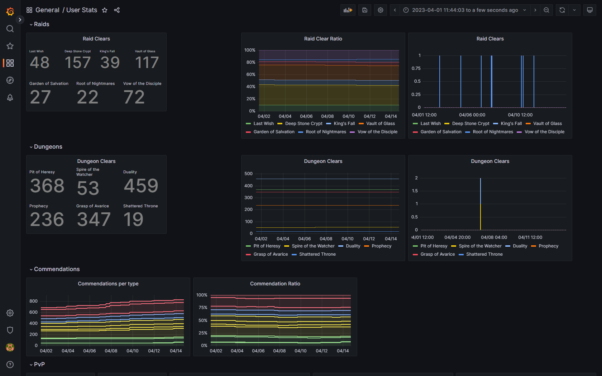
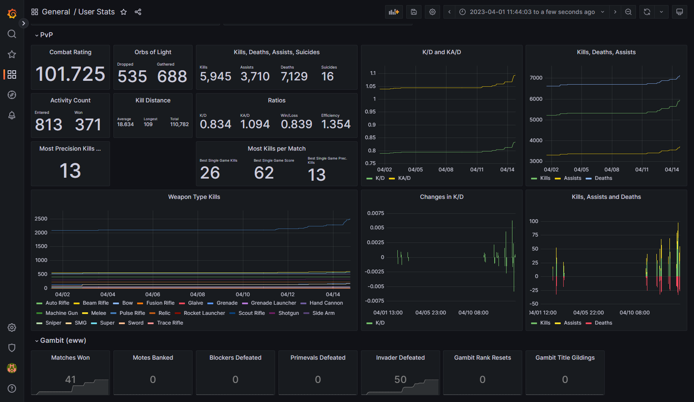

# D2StatCollector
A continuous stat collector for Destiny 2.

## What it does
This application collects data from the Destiny 2 API and stores it in a database.
It does this repeatedly for every user in **one or multiple Clans**.

Per default, it collects every 10 minutes, but you can adapt this setting.
I suggest that you do not lower this below 5 minutes.

#### Features of this repository in one look:
- Grab data for every member in one or multiple clans.
- Grab the data every 10 minutes (configurable).
- Store the data in a database. This is an InfluxDB 1.8 instance.
- Use a Grafana instance to visualize the data. 
- Complete docker-compose setup, easily configurable via environment variables. 
  - The Grafana instance is preconfigured for Discord authentication, including limited access to the dashboard on a Discord server basis.

## What it looks like
The docker-compose file starts a Grafana instance, which you can use to visualize the data.
You can use the collected data to make dashboards like this one. The json for this dashboard can be found [here](doc/example-dashboard.json).

## How to use
1. Modify the environment variables.
   1. Modify the `.env-influxdb` file to configure the database. Make sure to change the password to something secure.
   2. Modify the `.env-grafana` file to configure the Grafana instance. Also select a **very** secure admin password.
   3. Modify the `.env-collector` file to configure the collector. 
      1. Set the `CLAN_IDS` variable to the clan ids you want to collect data for. You can find the clan id in the URL of the Bungie.net clan page, for example [3862772](https://www.bungie.net/en/ClanV2?groupid=3862772).
      2. Specify how often you want to collect data in the `D2SC_INTERVAL_MINUTES` variable. The default is 10 minutes. Do not reduce this below 5 minutes.
      3. Specify your Bungie API credentials. You can get them [here](https://www.bungie.net/en/Application).
      4. Set the influxdb settings you chose in the `.env-influxdb` file. 
2. Now you can use `docker compose up` to start the application stack.
3. Connect to your Grafana instance. Per default, it is available at http://localhost:3000.
4. In Grafana, create a new datasource with the following settings:
   1. Type: InfluxDB
   2. URL: http://d2stat-influxdb:8086
   3. Database: telegraf
   4. User: telegraf
   5. Password: password (change this in the .env file)
   6. Example image can be found here: [grafana-datasource.png](doc%2Fgrafana-datasource.png)
5. Create new Dashboards and have fun!
   1. Here is an example dashboard (in json format) which you can import: [example-dashboard.json](doc%2Fexample-dashboard.json)

## Warnings
A few warnings:
- This application can be quite CPU intensive. I suggest that you run it on a dedicated machine. If you want to help with this, look at https://github.com/Mijago/D2StatCollector/issues/1.
- This application sends out many API calls. We have a Limit of 25 calls per second per IP, so if you let this run in your intranet, then it might happen that you can not use API tools (like DIM) and get "Connecting to Bungie Servers" ingame while the tool grabs data.
- The application saves *a lot* of data. For this, you can set up InfluxDB retention policies. If you want to help with this, look at https://github.com/Mijago/D2StatCollector/issues/7.

## Contribution
Feel free to contribute to this project. Just open a pull request. 
For a quick start, head over to the [issues](https://github.com/Mijago/D2StatCollector/issues?q=is%3Aissue+is%3Aopen+label%3A"good+first+issue") with the label "good first issue". Thanks!

Build the image with `docker build --target final -f D2StatCollector.Server/Dockerfile -t d2stat-collector:dev .` and change the image in the docker-compose file to `d2stat-collector:dev`.

